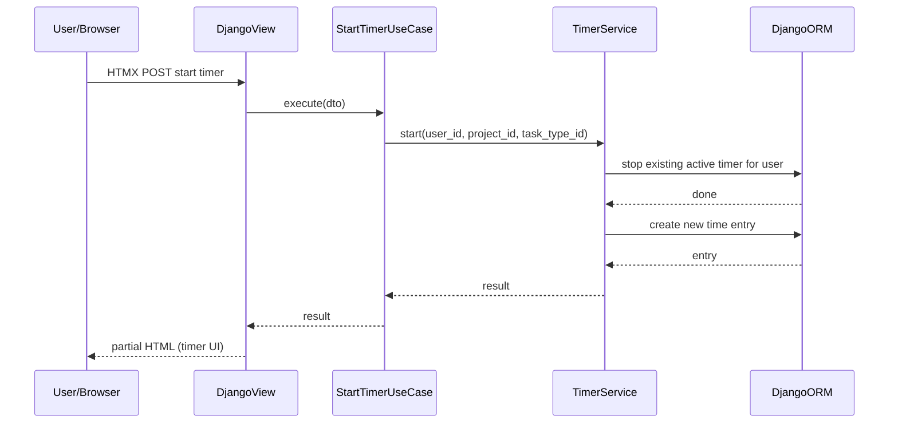
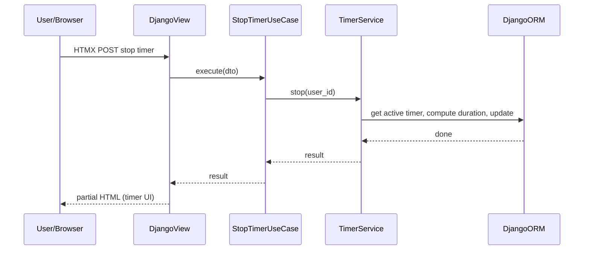

# Core Time Tracking — Implementation Task Summary

## Relevant Files

### Core Implementation Files

- `core/domain/services/timer_service.py` - TimerService: start/stop, enforce single active timer per user via ORM
- `core/domain/models/` - Time entry / timer state models (state and invariants only; no DB access)
- `core/use_cases/start_timer.py` - StartTimerUseCase; calls TimerService only
- `core/use_cases/stop_timer.py` - StopTimerUseCase; calls TimerService only
- `core/application/dtos.py` - DTOs for timer input/output
- `core/views/timer_views.py` - Views and HTMX endpoints for start/stop (no business logic)
- `templates/core/_timer_partial.html` - Partial template for timer UI (start/stop, active timer display)

### Integration Points

- `core/urls.py` or `project/urls.py` - URL routes for timer actions
- `templates/base.html` - Inclusion of timer partial in layout

### Documentation Files

- Inline or short doc on single-timer rule and flow (as in ADR "Example Flow: Start Timer")

## Sequence Diagram

### Start Timer

### Stop Timer

## Tasks

- [ ] 1.0 Implement domain models and TimerService (DB access only in service; single active timer per user)
- [ ] 2.0 Implement StartTimerUseCase and StopTimerUseCase (call TimerService; no direct ORM)
- [ ] 3.0 Add presentation: views and HTMX endpoints for start/stop timer (no business logic in views)
- [ ] 4.0 Build timer UI partial(s) with HTMX (start/stop, display active timer); limit full-page reloads for these actions
