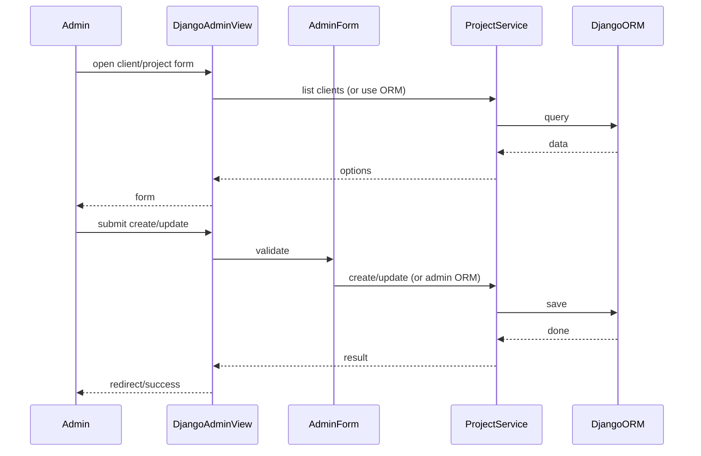
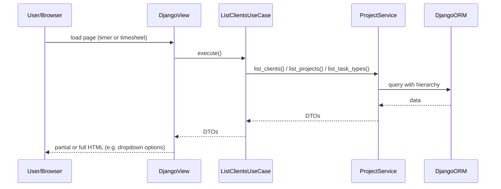

# Project & Client Management — Implementation Task Summary

This feature is implemented in the **project_management** app (separate from the `tracking` app).

## Scope (admin capabilities and user–client association)

- **Admin can:**
  - Create a **client**.
  - For each client, create **one or more projects**.
  - Full **CRUD for task types** (create, read, update, delete); task types are used as options for timer/timesheet (e.g. Design, Development, Meeting).
- **User–client association:**
  - Each user is **associated with one client** (e.g. via User profile or FK to `Client`).
  - This association is set by **admin** (e.g. in Django Admin when editing the user or a user profile).
  - Non-admin users only see clients/projects/task types scoped by their associated client.

## Data model and associations

- **Client ↔ Project:** Project belongs to a Client (e.g. `Project.client` FK). Hierarchy: Client > Project.
- **User ↔ Client:** Store the association (e.g. `UserProfile.client` FK or `User.client` FK if using a custom user). Admin assigns this; it is used to scope which clients/projects a non-admin can see when starting a timer or viewing timesheets.

## Access control (permissions)

- **Admin:** Full CRUD on Client, Project, and Task Type (e.g. via Django Admin or equivalent admin-only views). Task type CRUD means admin can create, read, update, and delete task types (e.g. in Django Admin).
- **Non-admin:** No CRUD on Client/Project; cannot access client/project management UI or APIs. Non-admin users can only consume client/project/task-type as **read-only options** (e.g. dropdowns for timer and timesheet), filtered by the **user’s associated client** (and thus that client’s projects).

Creating, editing, and deleting Clients and Projects and Task Types are **admin-only**. Non-admin users must not be able to use these management options.

## Relevant Files

### Core Implementation Files

- `project_management/domain/models/client.py` - Client model
- `project_management/domain/models/project.py` - Project model (Client > Project hierarchy)
- `project_management/domain/models/task_type.py` - Task Type model (e.g. Design, Development, Meeting); CRUD in admin
- `project_management/domain/models/user_profile.py` - User–client association (e.g. OneToOne to User + FK to Client), or equivalent on custom User model
- `project_management/domain/services/project_service.py` - ProjectService: all DB access for clients, projects, task types
- `project_management/use_cases/list_clients.py` - ListClientsUseCase (or similar) for dropdown/options
- `project_management/use_cases/list_projects.py` - ListProjectsUseCase (by client)
- `project_management/use_cases/list_task_types.py` - ListTaskTypesUseCase
- `project_management/admin.py` - Django Admin registration for Client, Project, Task Type, and user–client association (inline or separate so admin can assign users to a client)

### Integration Points

- `project/urls.py` - Admin URL configuration
- Timer and timesheet views (in `tracking` app) that consume client/project/task-type options via use cases

### Documentation Files

- Data hierarchy (Client > Project) and task types in user or ADR docs

## Sequence Diagram

### Admin: Create/Update Client or Project

### User: Load Options for Timer/Timesheet

## Tasks

- [x] 1.0 Implement Client and Project models and ProjectService (hierarchy; DB access in service only)
- [x] 2.0 Implement Task Type model; CRUD task type (create, read, update, delete) in admin; expose via ProjectService and list for dropdowns; integrate with time entry/timer
- [x] 3.0 Register Client, Project, and Task Types in Django Admin for admin-only changes
- [x] 4.0 Implement user–client association (model + admin); scope non-admin options by this association
- [x] 5.0 Ensure non-admin views use service/use-case layer for client/project/task-type options (no direct ORM in views); scope lists by user's associated client
