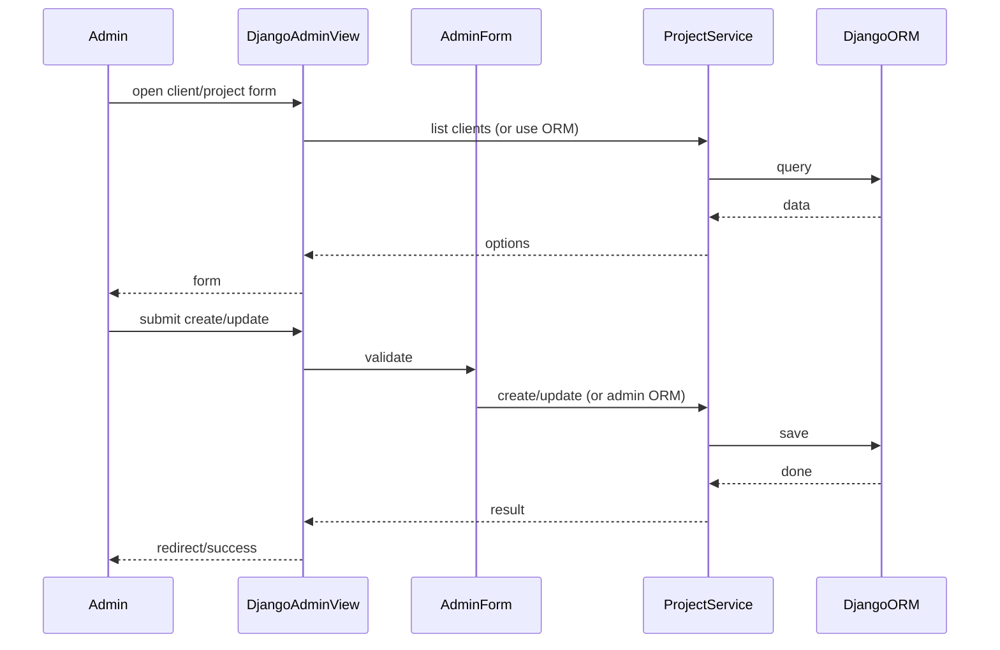
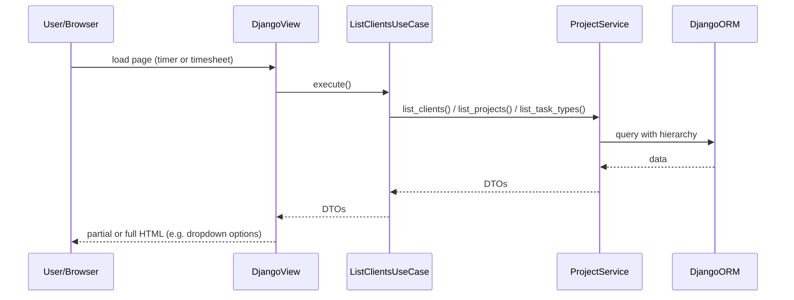

# Project & Client Management — Implementation Task Summary

## Relevant Files

### Core Implementation Files

- `core/domain/models/client.py` - Client model
- `core/domain/models/project.py` - Project model (Client > Project hierarchy)
- `core/domain/models/task_type.py` - Task Type model (e.g. Design, Development, Meeting)
- `core/domain/services/project_service.py` - ProjectService: all DB access for clients, projects, task types
- `core/use_cases/list_clients.py` - ListClientsUseCase (or similar) for dropdown/options
- `core/use_cases/list_projects.py` - ListProjectsUseCase (by client)
- `core/use_cases/list_task_types.py` - ListTaskTypesUseCase
- `core/admin.py` - Django Admin registration for Client, Project, Task Type

### Integration Points

- `project/urls.py` - Admin URL configuration
- Timer and timesheet views that consume client/project/task-type options via use cases

### Documentation Files

- Data hierarchy (Client > Project) and task types in user or ADR docs

## Sequence Diagram

### Admin: Create/Update Client or Project

### User: Load Options for Timer/Timesheet

## Tasks

- [ ] 1.0 Implement Client and Project models and ProjectService (hierarchy; DB access in service only)
- [ ] 2.0 Implement Task Type model and expose via ProjectService; integrate with time entry/timer
- [ ] 3.0 Register Client, Project, and Task Types in Django Admin for admin-only changes
- [ ] 4.0 Ensure non-admin views use service/use-case layer for client/project/task-type options (no direct ORM in views)
