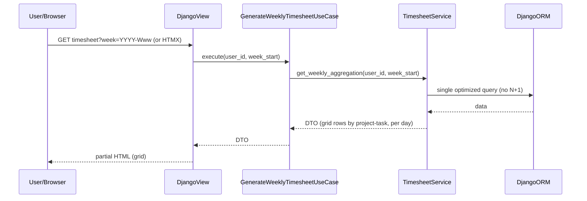
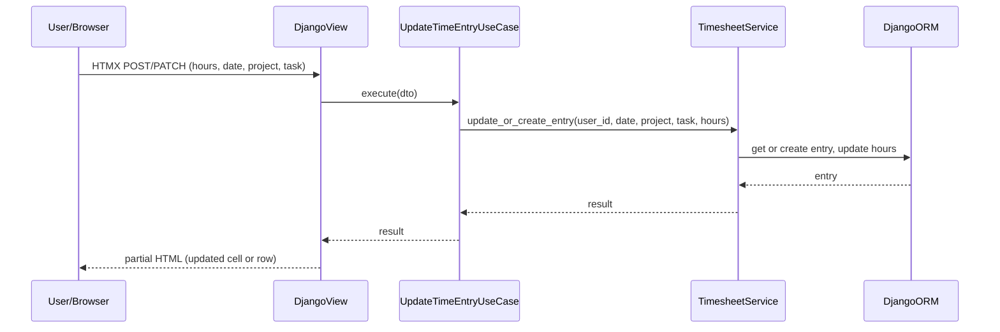

# Weekly Timesheet & Dynamic UX — Implementation Task Summary

## Relevant Files

### Core Implementation Files

- `core/domain/services/timesheet_service.py` - TimesheetService: weekly aggregation by project–task per day; efficient queries to avoid N+1
- `core/use_cases/generate_weekly_timesheet.py` - GenerateWeeklyTimesheetUseCase
- `core/use_cases/update_time_entry.py` - UpdateTimeEntryUseCase for manual/inline edits
- `core/views/timesheet_views.py` - Views and HTMX endpoints for grid, week navigation, inline editing
- `templates/core/_timesheet_grid.html` - Partial for weekly grid
- `templates/core/_timesheet_cell.html` or inline-edit partial - For cell/row updates

### Integration Points

- `core/urls.py` - URL routes for timesheet (week param) and inline update (PATCH/PUT or POST)
- HTMX targets and swaps for grid and row/cell updates (`hx-target`, `hx-swap`)

### Documentation Files

- Weekly grid behavior and navigation; inline editing and manual entry

## Sequence Diagram

### Load Weekly Timesheet / Change Week

### Inline Edit / Manual Entry

## Tasks

- [ ] 1.0 Implement TimesheetService and weekly aggregation (project–task × day; optimize queries to prevent N+1 in grid)
- [ ] 2.0 Implement GenerateWeeklyTimesheetUseCase and view for weekly grid; support week parameter for navigation
- [ ] 3.0 Add HTMX-driven week navigation (previous/next week) with partial updates (no full-page reload)
- [ ] 4.0 Implement inline editing of time entry values in the grid (HTMX PATCH/PUT or POST with partial response)
- [ ] 5.0 Support manual entry and update of hours for any day (same use case/service; validation and persistence in domain/service layer)
