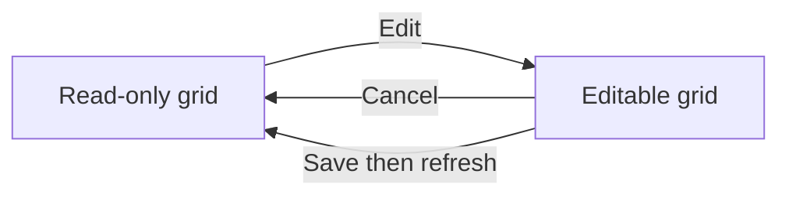

# Weekly timesheet on tracking page and UX improvements — Implementation Task Summary

**Depends on:** Task 04 (Weekly Timesheet & Dynamic UX), Task 05 (Manual Entry).

Embed the weekly timesheet on the tracking (home) page, default the first project in the timer, make the timesheet read-only by default with Edit / Cancel / Save, and improve design and UX.

## Relevant Files

### Core Implementation Files

- `tracking/views/__init__.py` - Home view: add week/timesheet context for embedded grid
- `tracking/views/timesheet_views.py` - Grid partial: support `editable`/`read_only`; optional shared week-context helper
- `templates/tracking/home.html` - Include timesheet grid in `#timesheet-grid-container`
- `templates/tracking/_timer_partial.html` - Select first project by default
- `templates/tracking/_timesheet_grid.html` - Edit / Cancel / Save controls; pass `timesheet_editable` to cell
- `templates/tracking/_timesheet_cell.html` - Branch on `editable`: show text (read-only) or form (edit)

### Integration Points

- `tracking/urls.py` - Existing `timesheet_grid`, `timesheet_update`; HTMX targets unchanged
- HTMX: grid partial accepts `?editable=1` or `?editable=0` for week nav from home

### Documentation Files

- README or docs: "Weekly timesheet on tracking page" (usage); update testing section

## Edit / Cancel / Save flow

## Tasks

- [x] 1.0 Embed weekly timesheet on tracking (home) page: home view provides week/timesheet context; home template includes grid in `#timesheet-grid-container`; week nav (HTMX) works from home.
- [x] 2.0 Default first project in timer: in `_timer_partial.html`, select the first project option by default.
- [x] 3.0 Timesheet read-only by default: add `editable`/`read_only` support to grid and cell partials; show hours as text when read-only.
- [x] 4.0 Add Edit / Cancel / Save: "Edit" switches to editable grid; "Cancel" reverts to read-only without saving; "Save" submits cell updates then reverts to read-only.
- [x] 5.0 Design and UX: card/section for timesheet on home, clear Edit/Cancel/Save grouping and labels, optional read-only vs edit visual distinction, trim redundant copy.
- [x] 6.0 Add or update tests: home view context (timesheet data), first project selected in timer, grid partial with `editable=False`; update README/docs.
