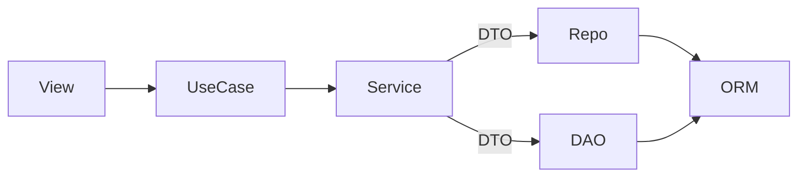

# Refactor — Repository/DAO Layer and DTO-Only Services

## Rules to Enforce

- **SOLID:** Single responsibility, dependency inversion (services depend on repository/DAO abstractions), clear boundaries.
- **Services:** Receive **DTO in**, return **DTO out**. No Django model instances (ORM) in service method signatures or return types.
- **Persistence layer:** New **Repository** layer holds all DB operations. Naming: **Repository** when the operation is about domain entities/aggregates; **DAO** for any other DB transaction (e.g. ad-hoc reads, existence checks, reporting).

## Repository vs DAO

- **Repository:** Persistence and querying of **domain entities/aggregates** (e.g. TimeEntry, Client, Project, TaskType, UserProfile). Naming: `TimeEntryRepository`, `ClientRepository`, etc.
- **DAO:** Any other DB access (e.g. pure existence checks, raw reporting queries, admin bulk operations) that do not map to a single domain aggregate. Can be methods on a dedicated DAO class or a small helper used by a repository.

## SOLID in This Refactor

- **S:** Services only orchestrate and enforce business rules; repositories/DAOs only do persistence/query.
- **O:** New persistence strategies can be added via new repository/DAO implementations without changing services.
- **L:** N/A for this refactor.
- **I:** Repository interfaces (abstract base classes or protocols) with narrow methods; services depend on abstractions.
- **D:** Services depend on repository/DAO abstractions (injected or passed in), not on concrete ORM.

## Architecture

**Current:** View → UseCase → Service → Django ORM (services contain all DB logic and sometimes return ORM/domain models).

**Target:**

- View → UseCase → **Service** (DTO in → DTO out; no ORM) → **Repository** (domain entities) or **DAO** (other DB) → Django ORM.
- Repositories/DAOs are the only place that use `Model.objects` or QuerySet; they translate to/from DTOs or simple value structures where needed.

## Relevant Files

### Core Implementation Files

- `tracking/domain/services/timer_service.py` - Refactor to use repositories and DTOs only
- `tracking/domain/services/timesheet_service.py` - Refactor to use repositories and DTOs only
- `tracking/infrastructure/repositories/time_entry_repository.py` (new) - TimeEntry persistence (domain → Repository)
- `tracking/infrastructure/daos/` (new, if needed) - Non-domain DB access (e.g. existence checks for project/task_type)
- `project_management/domain/services/project_service.py` - Refactor to use repositories and return DTOs only (no Client, Project, TaskType ORM in return types)
- `project_management/infrastructure/repositories/` (new) - Repositories for Client, Project, TaskType, UserProfile (domain entities)
- `project_management/infrastructure/daos/` (new, if needed) - DAO for non-domain DB operations
- `tracking/application/dtos.py` - Extend so every service output is a DTO (e.g. TimerResultDTO, ActiveTimerStateDTO, TimeEntrySummaryDTO)
- `project_management/application/dtos.py` - Ensure ClientOptionDTO, ProjectOptionDTO, TaskTypeOptionDTO are the only return types from ProjectService

### Integration Points

- Use cases in `tracking/use_cases/` and `project_management/use_cases/` - Keep calling services with DTOs; ensure they receive DTOs back (no ORM leakage)
- Views in `tracking/views/` - Already pass DTOs in; adjust if use case return types change to DTOs

### Documentation Files

- `docs/adr/architectural_decision.md` - Update to show the new Repository/DAO layer between Domain Services and Django ORM

## Tasks

- [x] 1.0 Define Repository/DAO layer and interfaces: Create package `tracking/infrastructure/repositories` (or `tracking/domain/repositories` with implementations in infrastructure). Define interfaces (protocol or ABC) for TimeEntry persistence. Same for project_management (Client, Project, TaskType, UserProfile).
- [x] 2.0 Implement TimeEntryRepository: Move all `TimeEntry.objects` usage from TimerService and TimesheetService into TimeEntryRepository. Repository methods take/return DTOs or simple dataclasses (no ORM).
- [x] 3.0 Implement ProjectManagement repositories (and DAO if needed): Move all Client/Project/TaskType/UserProfile ORM access from ProjectService into repository (or DAO for non-domain queries). Methods return DTOs or data needed to build DTOs.
- [x] 4.0 Refactor TimerService: Accept DTO in; call TimeEntryRepository (and any DAO) for DB; return only DTOs (e.g. TimerResultDTO; no ORM in signatures).
- [x] 5.0 Refactor TimesheetService: DTO in, repository/DAO for DB, DTO out. Replace `TimeEntry` return with an output DTO (e.g. TimeEntrySummaryDTO).
- [x] 6.0 Refactor ProjectService: DTO in, repository/DAO for DB, DTO out. Replace `List[Client]` / `List[Project]` / `List[TaskType]` with list of DTOs (ClientOptionDTO, ProjectOptionDTO, TaskTypeOptionDTO).
- [x] 7.0 Introduce missing output DTOs: Ensure every service return type is a DTO (or agreed non-ORM type). Add TimerResultDTO, ActiveTimerStateDTO (or equivalent), TimeEntrySummaryDTO if not present.
- [x] 8.0 Update use cases and tests: Use cases and tests use only DTOs; no assertions on ORM models from service layer. Update integration tests to assert on DTOs and, where needed, on DB state via repository or ORM in test only.
- [x] 9.0 Update ADR: Document the new Repository/DAO layer and the "services = DTO in / DTO out" and "domain = Repository, other = DAO" rules.
